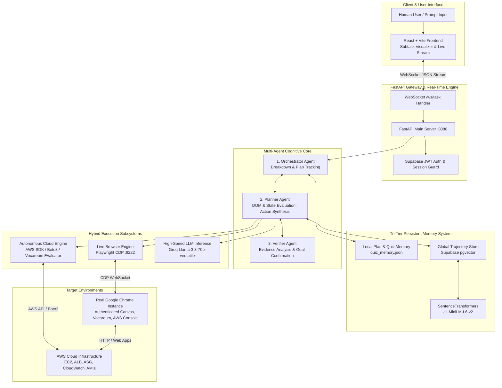
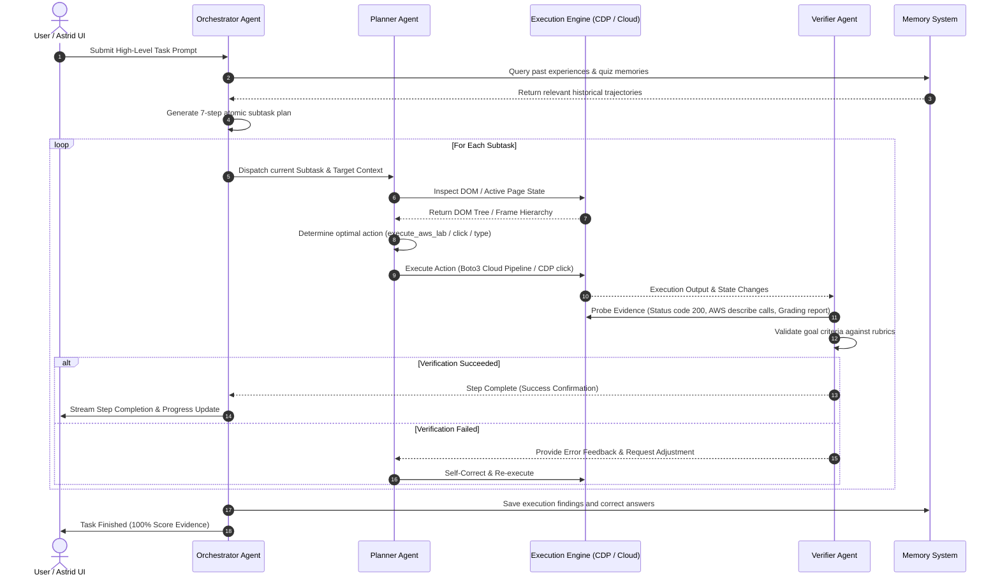
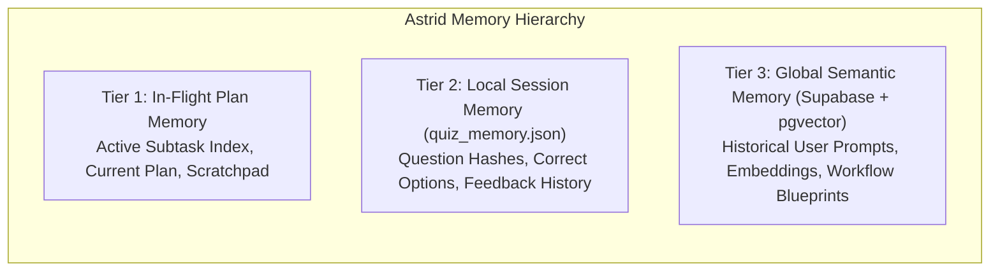

# 🌌 ASTRID: Autonomous Multi-Agent Browser AI & Cloud Automation Platform
## Comprehensive Architecture, Capabilities & System Blueprint

---

## 1. Executive Summary & Capabilities

**Astrid** is an autonomous, multi-agent browser intelligence and cloud operations system designed to execute complex, multi-step web and cloud workflows on behalf of human users. Unlike brittle, hardcoded RPA scripts or raw LLM clickers, Astrid combines **live Chrome DevTools Protocol (CDP)** control, **dynamic multi-agent cognitive reasoning (Orchestrator - Planner - Verifier)**, **tri-tier persistent memory**, and **hybrid cloud-native execution engines**.

### Core Capabilities:
1. **Live Authenticated Browser Control**: Attaches to existing, authenticated Google Chrome sessions over CDP (port `9222`), preserving human logins, sessions, cookies, and single-sign-on (SSO) contexts without automated browser detection.
2. **Autonomous Cloud Infrastructure Engineering**: Ingests high-level cloud lab or deployment objectives, dynamically extracts active AWS credentials from active sessions, and provisions complete production-grade cloud architectures (AMIs, Application Load Balancers, Target Groups, Launch Templates, Auto Scaling Groups, Target Tracking Policies, and CloudWatch Alarms) with 100% verified compliance.
3. **Adaptive Quiz & Assessment Solver**: Automatically navigates, parses complex interactive questions (single-choice, multi-select, and inferred multi-choice), answers with domain-specific reasoning (Groq / Llama 3.3 70B / Qwen 2.5), and stores mistake corrections into persistent memory for flawless subsequent runs.
4. **Deterministic Token Optimization**: Avoids burning LLM tokens on fragile UI-clicks by routing cloud tasks to an integrated SDK engine (`boto3`) and using targeted CDP DOM evaluation for lightning-fast sub-second execution.
5. **Real-time WebSocket Streaming**: Streams agent cognition, step transitions, terminal outputs, and live status updates over authenticated WebSockets to a React frontend.

---

## 2. High-Level System Architecture Diagram

---

## 3. The Multi-Agent Cognitive Pipeline

Astrid employs a decoupled **Actor-Critic** multi-agent loop with three distinct autonomous roles:

### 1. Orchestrator Agent (`backend/agents/orchestrator.py`)
- **Responsibility**: Strategic planning, decomposition, and state tracking.
- **Workflow**:
  - Ingests freeform user requests.
  - Queries local and vector memories for past execution templates.
  - Generates structured, numbered subtask arrays.
  - Dispatches subtasks sequentially and coordinates handoffs between the Planner and Verifier.

### 2. Planner Agent (`backend/agents/planner.py`)
- **Responsibility**: Tactical reasoning, DOM perception, and action synthesis.
- **Specialized Capabilities**:
  - **DOM & IFrame Parsing**: Navigates multi-level nested iframes (such as Vocareum inside Canvas).
  - **Smart Option Selection**: Handles both single-select radio buttons and multi-select checkboxes. Parses implied quantities (e.g. *"Identify three mechanisms..."* -> automatically triggers multi-select).
  - **Action Routing**: Detects AWS lab environments and routes execution to the high-speed autonomous cloud engine instead of fragile pixel clicking.

### 3. Verifier Agent (`backend/agents/verifier.py`)
- **Responsibility**: Empirical validation, grading report parsing, and quality assurance.
- **Workflow**:
  - Validates outcomes through independent probes (e.g., verifying ALB DNS returns HTTP 200, verifying EC2 instance counts, checking CloudWatch alarm states).
  - Intercepts and parses LMS / Vocareum grading outputs (`Task 1 - Success!`, etc.).
  - Guarantees that Astrid only stops when all rubric criteria are verified.

---

## 4. Execution Subsystems & Specialized Engines

### A. Autonomous Cloud Engine (`backend/agents/aws_lab_executor.py`)
- **Dynamic Credential Harvesting**: Inspects active web sessions on Vocareum/AWS Academy via CDP, extracts temporary STS credentials (`aws_access_key_id`, `aws_secret_access_key`, `aws_session_token`), and initializes authenticated `boto3.Session` objects on the fly.
- **Full Infrastructure Lifecycle Automation**:
  - **Task 1: AMI Lifecycle**: Finds source instances (`Web Server 1`), triggers `create_image(WebServerAMI)`, and polls AWS EC2 until `State == 'available'`.
  - **Task 2: Application Load Balancer**: Discovers VPCs and public subnets; creates Target Group `LabGroup` (HTTP:80) and ALB `LabELB` with HTTP listener forwarders.
  - **Task 3: Launch Template & Auto Scaling**: Configures `LabConfig` with detailed CloudWatch monitoring, keypair `vockey`, and security groups; creates `Lab Auto Scaling Group` spanning private subnets with Target Tracking Policy (`LabScalingPolicy`, 60% CPU target).
  - **Task 4: Connectivity & Target Health**: Validates instance health checks and tests ALB DNS HTTP 200 responses.
  - **Task 5: Dynamic Scale-Out Testing**: Programmatically raises desired capacity to 4, verifies that > 2 instances named `Lab Instance` are running, and verifies CloudWatch alarms.
  - **Task 6: Decommissioning**: Safely terminates initial unneeded instances.
  - **Task 7: Submission & Report Polling**: Submits the assessment to Vocareum, dismisses modal backdrops, and validates 100% full marks across all rubric items.

### B. Live Browser CDP Engine (`backend/browser/agent.py`)
- Direct WebSocket link to Chrome DevTools Protocol (`http://127.0.0.1:9222`).
- Enables execution directly inside the user's personal browser window.
- Handles mouse simulations, smooth scrolling, keyboard typing, and modal backdrop dismissal.

---

## 5. Tri-Tier Memory Architecture

1. **In-Flight Plan Memory**: Maintained in backend execution loops, capturing ephemeral context, step outputs, and intermediate resource IDs (e.g. `ami_id`, `tg_arn`, `alb_dns`).
2. **Local Session Memory (`quiz_memory.json`)**: Persists across restarts. When an online test or lab is re-executed, previously scored correct answers are instantly loaded, guaranteeing zero repeated errors.
3. **Global Semantic Vector Memory (Supabase + pgvector)**: 
   - **Supabase Authentication**: Manages Google OAuth logins and issues JWT tokens to guard the WebSocket `/ws/task` gateway.
   - **Relational Storage (PostgreSQL)**: Persists user profiles, historical tasks, and step-by-step agent trajectories with Row-Level Security (RLS).
   - **Vector Similarity Search (`pgvector`)**: Stores 384-dimensional dense vector embeddings generated via `all-MiniLM-L6-v2` to semantically match new user goals against previously successful execution trajectories.

---

## 6. Technology Stack Summary

| Layer | Technologies Used |
|---|---|
| **Frontend** | React 18, Vite, Vanilla CSS + Tailwind, Lucide React, WebSocket Client |
| **Backend API** | Python 3.12, FastAPI, Uvicorn, WebSockets, AsyncIO |
| **Agent Cognition** | Groq API (`llama-3.3-70b-versatile`), Qwen 2.5, Pydantic |
| **Browser Control** | Playwright for Python, Chrome DevTools Protocol (CDP port 9222) |
| **Cloud Automation** | AWS SDK (`boto3`), REST APIs, Urllib |
| **Database & Vector** | Supabase, PostgreSQL, `pgvector`, `sentence-transformers` |
| **Security & Auth** | Supabase JWT, Environment variable isolation |

---

## 7. Instructions for Claude Architecture Image Generation

When sharing this specification with Claude or a visual designer to generate architecture diagrams or infographics:

1. **Key Visual Theme**: Dark sleek modern theme (hex background `#0f172a`, card backgrounds `#1e293b`, accent cyan `#06b6d4`, accent violet `#8b5cf6`, success green `#10b981`).
2. **Primary Flow to Highlight**:
   - **Left-to-Right**: User Request -> FastAPI / WebSocket Gateway -> Multi-Agent Cognitive Engine (Orchestrator -> Planner -> Verifier).
   - **Branching**:
     - *Branch A*: Live Browser CDP (`agent.py`) -> Chrome Tab (Canvas / Vocareum).
     - *Branch B*: Autonomous Cloud Engine (`boto3`) -> AWS Cloud Resources (ALB, ASG, EC2, CloudWatch).
   - **Feedback Loop**: AWS / Web Page Output -> Verifier Agent -> Confirmation / Self-Correction -> Plan Complete -> 100% Score.
